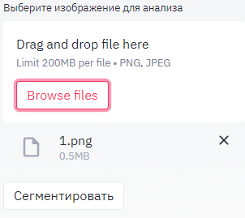

# Segmentations-Demo

1. before starting execute down_load_models_and_data.py

2. put urls.json into root folder

3. to run application type: streamlit run app.py

4. while running application delete image from cache (click "X") before loading a new one:

